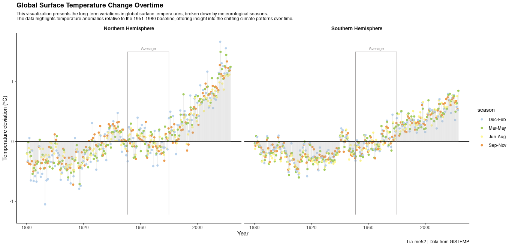

# Global Surface Temperature Change Visualization

This repository contains an R script that visualizes global surface temperature changes over time, highlighting anomalies by season and hemisphere. The script processes and visualizes temperature anomaly data using `ggplot2`, showing temperature variations from 1950 to the present. Data is split by hemisphere (Northern and Southern) and season (DJF, MAM, JJA, SON), with anomalies relative to the 1951-1980 baseline.

